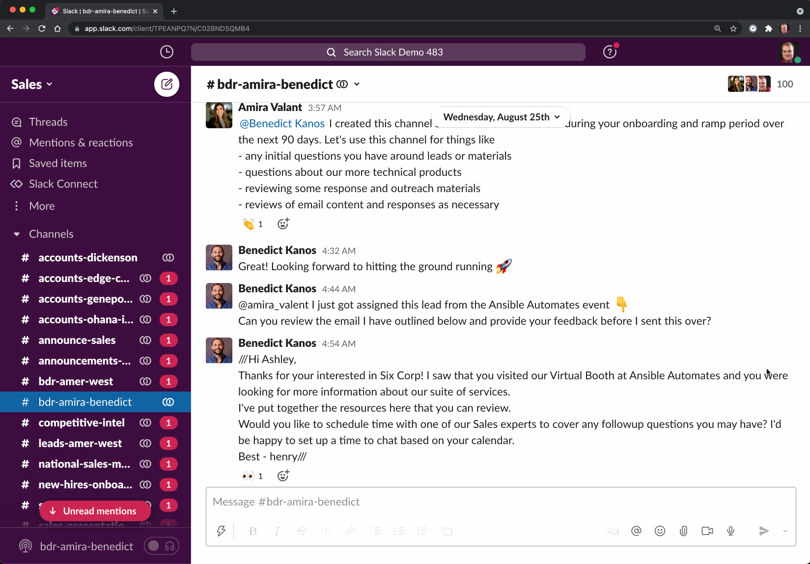

# Reacjilator for Slack

Reacjilator translates a message when a user reacted with an emoji (*"reacji"*). For example, when a message gets a `:flag-jp:` reacji, this bot translate the original message to Japanese and post it under the message thread.




## Host Your Own & Run the Bot on Your Slack Workspace

### Set Up Your Slack App

1. Create an app at your Slack App Setting page at [api.slack.com/apps?new_app=1](https://api.slack.com/apps?new_app=1):
2. Enable events, `reaction_added` and point to `https://your-server.com/events`
3. Enable Bot user
4. Set Scopes:
  - `chat:write:bot` (Send messages with chat.postMessage by a bot),
  - `reactions:read` (Access the workspace’s emoji reaction history)
  - `channels:read` (Access public channels info)
  - `channels:history` (Access user's public channels)
  - Also, `mpim.history` etc. all other `*.history` scopes, if you want the bot to work on private channels and DMs


### Deploy This Code on Your Own Server

Rename the `.env_test` to `.env` and fill the env vars with yur credentials:

```
SLACK_CLIENT_ID=
SLACK_CLIENT_SECRET=
SLACK_VERIFICATION_TOKEN=
SLACK_AUTH_TOKEN=
GOOGLE_PROJECT_ID=
GOOGLE_KEY=
```

Get Your Slack credentials at: `https://api.slack.com/apps/[YOUR_APP_ID]/general` at **Basic Information**, auth token at **OAuth & Permissions**.

Get your Google Cloud project ID and API key at [cloud.google.com](https://cloud.google.com/translate/docs/getting-started)

...or use this Heroku button to deploy to Heroku server. You just need to fill out the env vars with the info. No need to create an `.env` file.

[](https://heroku.com/deploy?template=https://github.com/slackAPI/reacjilator)

*When you deploy to Heroku, the request URL for the **Event Subscription** section on Slack App config page would be: `https://the-name-you-picked.herokuapp.com/events`*
